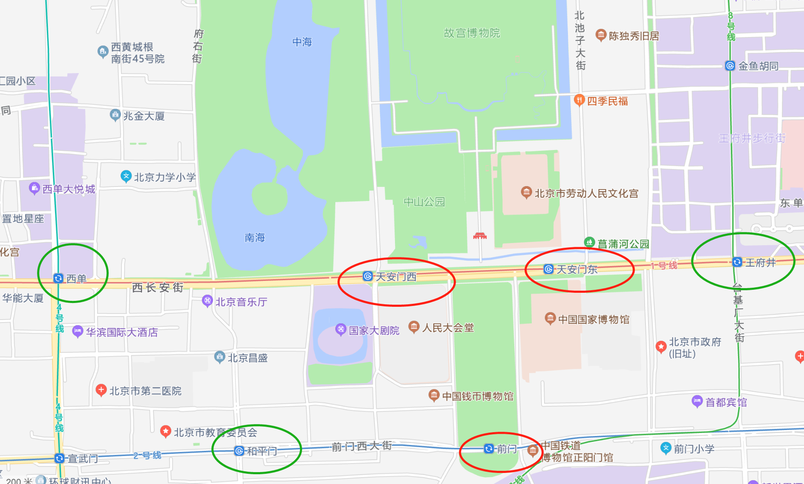
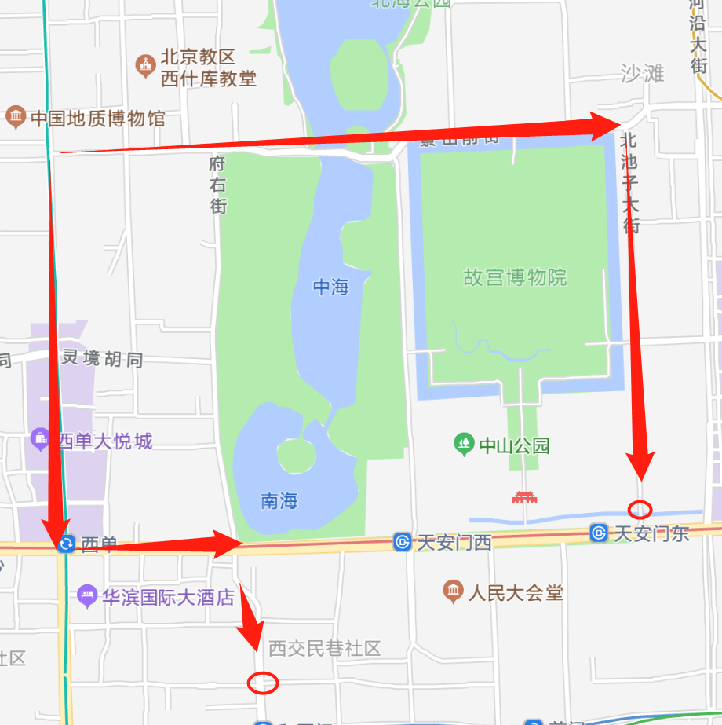
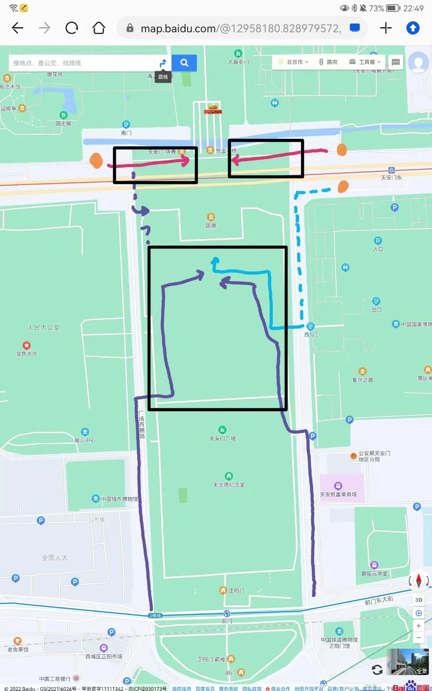
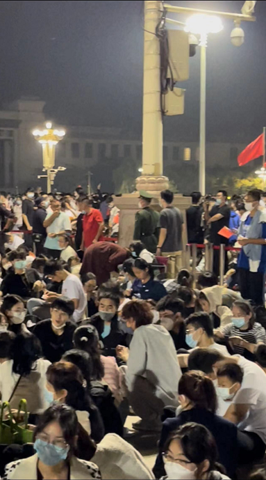

# 国庆天安门看升旗

经过了去年国庆、元旦，以及这个国庆陪学弟学妹去看升旗的经历，我大致总结了一些经验，同时参考[关于国庆看升旗的一些Tips](https://mp.weixin.qq.com/s/4T8XFzKUll8BQ4jg61xnsQ)，为将来想要去看升旗的uu提供一些建议。

## 写在最前面

说实话，对于每一个在国庆或者元旦期间看过升旗的朋友来说，其实大都不愿意来第二次，因为实在是太累。但是这确实是一次非常特别的感受，与数万人一起经过数小时的等待，最后迎来五星红旗随着太阳升起的过程。真要说的话，其实到天安门广场看升旗，并不一定能够很清楚地看到升旗的过程，我觉得更多的是在“抢”着看升旗的氛围以及愿意为这几分钟过程等待几小时的一种体验感。我认为对于第一次在天安门广场看升旗的同学来说，应该是收益远大于成本的事情啦~😄

## 准备

### 预约

首先，你需要先在微信小程序**天安门广场预约参观**预约你预计的升旗时间（本文讨论的情况主要是国庆10月1日与元旦1月1日人数较多的情况）。小程序开放了**十天以内**的预约。你只需要在这个时间段内并提前至少一天预约。

!!! tips "提示"

    成功预约天安门城楼，毛主席纪念堂，国博，故宫等的同学可以凭预约记录通过核验安检，不需要再预约啦~

### 携带物品

预约成功之后，可以开始考虑携带物品的事情啦，下面列出我这几次天安门参观预约携带的东西。

- **身份证**（必带），校园卡（出校必带）；
- **比较厚的衣物**。一件薄的衣服肯定是不够的，日出前后的气温会比白天低非常多。建议提前查看天气预报，国庆和元旦的夜间都比较冷；
- **轻薄雨具**（越轻越好，我去的三次都没有下雨）；
- **食物和水**。晚上排队通常需要好几个小时，等到次日散场，差不多已经7点左右，可以适当带一些食物和水；
- **自拍杆**。5点之后到升旗时，几乎广场上全是自拍杆，如果不携带自拍杆的话很难拍到任何东西。（但是自拍杆不能带进博物馆）；
- **充电宝**。一般来说，不携带充电宝的同学通常会在升旗前一两个小时将电耗光，升旗时就无法进行拍照了（特别是苹果用户，耗电会很快）；
- 小红旗。这些物品确实能增添国庆氛围，一般广场附近也会有游商销售。（但是越近越贵）；

!!! attention "注意"

    天安门广场对纸制品查得比较严，书籍、草稿纸等在安检时需要专门拿出来检查，不过绝大多数都能进，可以放心。

### 早去还是晚去？

去看升旗的朋友们大多都有一个问题，那就是看升旗应当是什么时候出发。出发的太早，我们需要在广场等待更久的时间，去得太晚，我们怕不能按时进入天安门广场观看升旗，同时，去的早晚也会直接决定你观旗的效果

我的建议如下：

|            预计的位置            |           出发时间           |
| :------------------------------: | :---------------------------: |
| 最前排，可能会接受中央电视台采访 | 前一天下午7-9点吃完晚饭后出发 |
|   中前，能清晰看到升旗以及出旗   |       前一天下午9-12点       |
|    中间及中后，能清晰看到升旗    |           12点-1点           |
|              能进场              |            1点-3点            |

!!! note "建议"

    时间因疫情以及北京市大学生出校安排而改变。上面时间对应学院路打车到天安门广场，沙河校区的同学自行提前一小时。

## 前往

### 交通工具

!!! tips "提示"

    推荐结合下一部分的路线图进行交通工具的选择。

#### 推荐搭乘地铁到天安门广场

需要注意的是，根据往年经验，从9月30日到国庆升旗结束后，1号线天安门东站、天安门西站和2号线前门站都会封站，列车通过不停车。一般从1号线王府井站、2号线和平门站走过去会比较近。

标红的通常封站，可选择从标绿站点下车

!!! tips "提醒"

    如果搭乘地铁，需要首先注意地铁运行时间。

#### 推荐打车去天安门广场

因为长安街晚上11点左右可能会封路，因此打车一般只会在周边落客，之后就要靠自己步行了。

一般来说到图中位置就会开始堵车（或者是很长的红绿灯），画圈的位置一般是下车点，然后需要自己跟人群进入天安门广场或广场一侧

#### 骑自行车

有时候因为各种原因，你无法搭乘到地铁，并且你认为打车太贵，你可以考虑从学院路骑共享单车到天安门广场，你会在路上碰见形形色色的人共同骑着共享单车往天安门广场去，你甚至不用导航，跟着人群走即可。这也是我经历的另一番独特的体验。

但是单车也无法直接骑到广场附近，不过相较于打车，骑共享单车会更近，在广场东西侧有回收共享单车的点，到点后只能步行前往广场。

### 路线图

下面引用[这篇文章](https://mp.weixin.qq.com/s/4T8XFzKUll8BQ4jg61xnsQ)：

查了一下网上的资料，排队路线是有好多条的，看升旗的地点也可以选在城楼一侧或广场上。比如：

①天安门西侧安检，城楼西侧华表附近观景；

②天安门东侧安检，城楼东侧华表附近观景；

③国家博物馆北侧安检，广场观景；

④广场西南侧安检，广场观景；

⑤广场东南侧(铁道博物馆附近)安检，广场观景；

⑥……（或许还有更多我不知道的路线）

- 黑色方框：主要的观看升旗区域（推荐在广场看，效果更佳）
- 黄色实心圆：我已知的广场北面的几个安检口（南面还有，我不清楚就不写了）
- 粉红色箭头：在城楼一侧观看升旗的线路
- 蓝色箭头：其中虚线部分是排队路线，实线部分是冲刺路线
- 紫色箭头：通放行拐来拐去走到的路线

|      路线      |                                                                              优势                                                                              |                                缺点                                |
| :------------: | :-------------------------------------------------------------------------------------------------------------------------------------------------------------: | :-----------------------------------------------------------------: |
| 粉红色城墙路线 | 1. 人少 2. 线路近，走路少 3. 快的话能看见国旗护卫队从城墙里走出来 4. 看完后能直接进天安门里 5. 有一定几率抽中途中紫色虚线方向进入优势位观看 | 1. 与国旗有一路之隔 2. 面积小，人挤人 3. 似乎是没有厕所的 |
|  蓝色国博路线  |                                      1. 冲刺距离短（不到300米），体力消耗小 2. 排队路线有洗手间 3. 有机会抢到C位                                      |                          *（文章作者未写）                          |
| 紫色侧后方路线 |                  1. 沿途有洗手间（如果是经过老巷子的话）  2. 沿途有水卖（如果是经过老巷子的话） 3. 可以打卡人民大会堂、国家歌剧院等                  |                     1. 冲刺距离长，很难抢到C位                     |

!!! tips

	走天安门广场一侧会在大花篮差不多的位置拉红线，必须要得在红线前，红线后既看不到，人又多。个人蛮推荐红线前靠后的位置（人少，可以坐着躺着睡觉）

红线前后

## 结束后

作为一个有高素质的大学生，请整理好自己的随身物品和垃圾。:smile:

位于广场上的uu们可以考虑往庆丰包子铺去吃一餐啦~（不过人是真的很多）

## 提醒

- **少喝水，少喝水，少喝水**！广场上几乎没有厕所，只在旁边排队区域有，能上厕所的最后机会一般是广场开门前/冲刺开始前这段时间，所以前一天晚上尽量少喝水。
- **提前约定集散点**。如果是和朋友分批前往，一定得事先约定好碰头位置或者结束后相会的位置，（广场上相遇真的很难）。因为广场上没有信号（包括天安门周围信号都很差），基本上发不出去微信消息。如果遇到特殊情况，记得使用**短信**联系。
- 要是去得早，当然可以直接投入排队，但也可以找地儿先休息。推荐王府井，街边有可以休息的长椅，附近甚至有家海底捞；缺点是24小时营业的店也没多少。此外，附近的地下通道也是好地方，灯很亮，还能提供娱乐的空间。
- 国庆节的天安门一带真的很漂亮，长安街有十多个大花坛，广场上也会有经典的“祝福祖国”巨型花果篮景观。天安门附近的景点也多在8-9点开门，不困的话看完升旗也可以在附近逛逛！

### 祝大家都能抢到好位置！共享欢乐时刻！