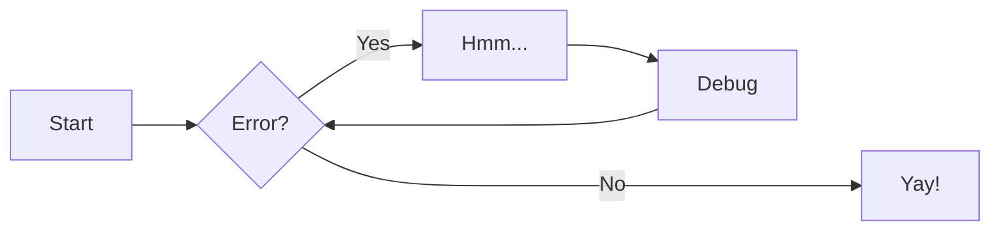
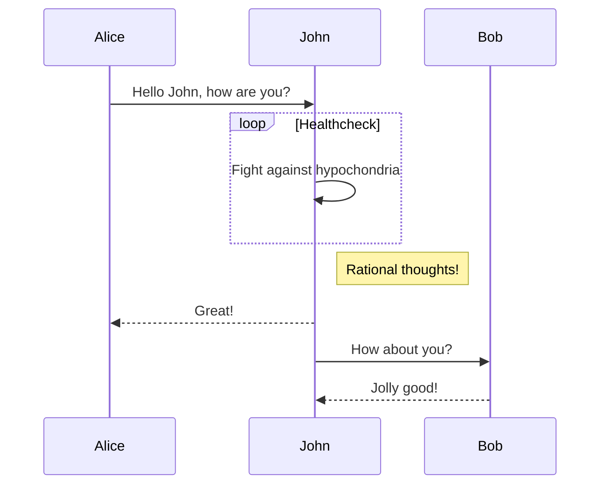
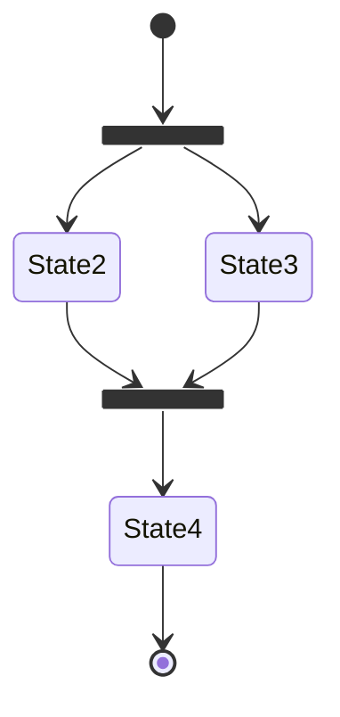

# 可用的markdown语言

> 本文将收录非官方 markdown 语言。

## 提示

```
!!! question "这是一个问题"

    所以我该问什么好呢？
```

!!! question "这是一个问题"

    所以我该问什么好呢？

类似地，你可以通过 ` !!! 关键字 "标题"` 的方法来使用其他的提示，当然在没有标题的时候默认显示关键字。

现在可供使用的 关键字 有以下：（后方对应图标样式）

```
      note: octicons/tag-16
      abstract: octicons/checklist-16
      info: octicons/info-16
      tip: octicons/squirrel-16
      success: octicons/check-16
      question: octicons/question-16
      warning: octicons/alert-16
      failure: octicons/x-circle-16
      danger: octicons/zap-16
      bug: octicons/bug-16
      example: octicons/beaker-16
      quote: octicons/quote-16
```

## 按钮

```
[在Github上Star我们!](https://github.com/buaainfo/buaainfo){ .md-button }
```

[在Github上Star我们!](https://github.com/buaainfo/buaainfo){ .md-button }

基本格式

```
[文字](网址){ .md-button  参数}
```

其中 `参数`可以选择 `.md-button--primary` 来填充整个按钮。

此外，`文字`中可以自行添加图标语法，例如 `[发送 :fontawesome-solid-paper-plane:]`会在 `发送`后添加一个小飞机的按钮。其他的图标您可以在[这个地方](https://squidfunk.github.io/mkdocs-material/reference/icons-emojis/)搜索到。

## 代码块

````
``` py title="bubble_sort.py" linenums="1" hl_lines="2 3"
def bubble_sort(items):
    for i in range(len(items)):
        for j in range(len(items) - 1 - i):
            if items[j] > items[j + 1]:
                items[j], items[j + 1] = items[j + 1], items[j]
```
````

```py
def bubble_sort(items):
    for i in range(len(items)):
        for j in range(len(items) - 1 - i):
            if items[j] > items[j + 1]:
                items[j], items[j + 1] = items[j + 1], items[j]
```

通过 `title="<custom title>"`可以自定义标题，通过添加[语言简码](https://pygments.org/docs/lexers/)可以使语法突出显示，通过 `linenums="1"`表示行号，通过 `hl_lines="n1 n2 n3"`可以高亮代码。

## 脚注引用

脚注始终出现在页面底部

```
鲁迅先生说过[^1]
[^1]: 其实他没有说过。
```

鲁迅先生说过[^1]

[^1]: 其实他没有说过。
    
## emoji

`:smile:`

😄

对于其他的emoji，您可以在[这里](https://squidfunk.github.io/mkdocs-material/reference/icons-emojis/)找到

## 图像

然而只能左右对齐。`align=left` `align=right`

```title=
[](https://buaa.asia/image/JKcA){ align=left }
```

[](https://buaa.asia/image/JKcA){ align=left }

## 图表

尽管我们认为这些语言在实际应用中并不很多，但是我们还是希望您在需要的时候能够了解它们。

### 流程图

````

````


### 序列图

````

````


### 状态图

````

````


